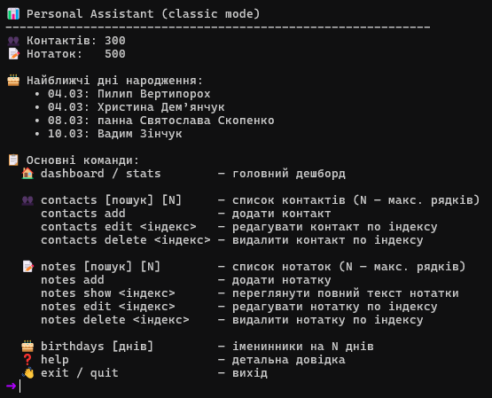
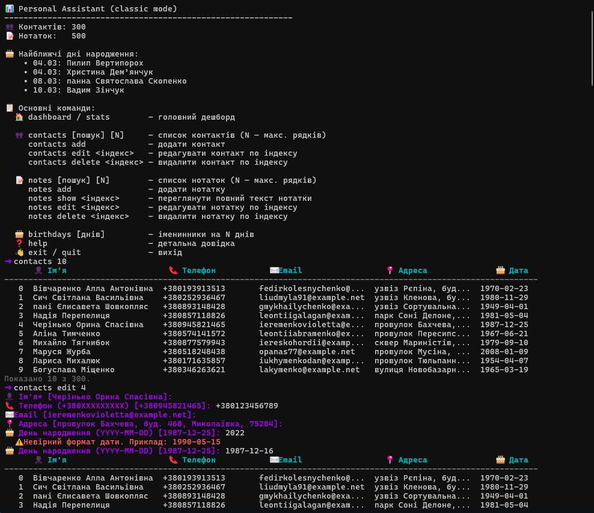

# ⌨️ Classic — консольний режим

У класичному режимі застосунок працює без asciimatics: після запуску показується текстовий «дешборд», далі в циклі приймаються команди з клавіатури, виконуються ті самі операції (контакти, нотатки, дні народження), результат виводиться в консоль з підтримкою кольорів.

## 🚀 Запуск

```bash
python main.py --classic
```

Або в [config.yaml](../config.yaml) встановити `classic: true` і запускати `python main.py`.

## 📊 Початковий екран

Після запуску виводяться: заголовок, кількість контактів і нотаток, поточна дата, найближчі дні народження (7 днів) та підказка ввести `help`.



*Зображення: консольний вивід при старті (статистика, дні народження).*

## 📋 Команди

| Команда | Опис |
|---------|------|
| `help` | 📖 Список усіх команд |
| `stats` / `dashboard` | 📊 Статистика та найближчі ДН |
| `contacts search [пошук] [N]` | 📇 Пошук контактів (опційно термін і/або ліміт рядків N) |
| `contacts add` | ➕ Інтерактивне додавання контакту |
| `contacts edit N` | ✏️ Редагувати контакт за індексом зі списку `contacts search` |
| `contacts delete N` | 🗑️ Видалити контакт за індексом |
| `birthdays [N]` | 🎂 Дні народження на N днів (за замовч. — 7) |
| `notes search [пошук] [N]` | 📝 Пошук нотаток (опційно термін і/або ліміт рядків N) |
| `notes add` | ➕ Інтерактивне додавання нотатки |
| `notes show N` | 👁️ Переглянути повний текст нотатки за індексом |
| `notes edit N` | ✏️ Редагувати нотатку за індексом |
| `notes delete N` | 🗑️ Видалити нотатку за індексом |
| `exit` / `quit` | 🚪 Вихід |

Команди **contacts** та **notes** вимагають підкоманди (search, add, edit, delete, show). Індекси для `show`, `edit` та `delete` — це числа в першій колонці таблиці при виконанні `contacts search` або `notes search`.

## 📏 Ліміт рядків (підкоманда search)

У підкоманді **search** для **contacts** та **notes** можна обмежити кількість рядків у виводі:
- **contacts search 10** — показати перші 10 контактів (без пошуку).
- **contacts search john 5** — пошук за «john» і не більше 5 результатів.
- **notes search 20** — перші 20 нотаток.
- **notes search робота 5** — пошук за «робота», максимум 5 рядків.

Якщо результатів більше за вказаний ліміт, під таблицею з’являється підсумок *«Показано N з M»*.

## 💡 Вгадування команд

Якщо введена команда не розпізнана, застосунок показує пропозицію найближчої команди (через `difflib`), наприклад: *«Можливо, ви мали на увазі: contacts»*.

## 🎨 Кольори

У консолі використовуються ANSI-кольори (на Windows підтримка через colorama): заголовки, успіх, підказки та помилки виділені різними кольорами для зручності читання.



*Зображення: приклад виводу команди з кольорами.*
