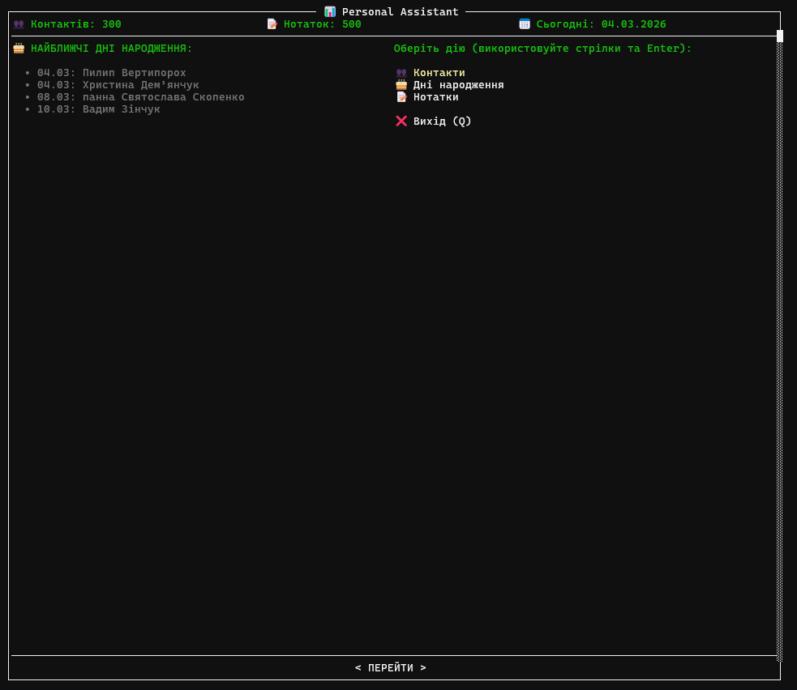
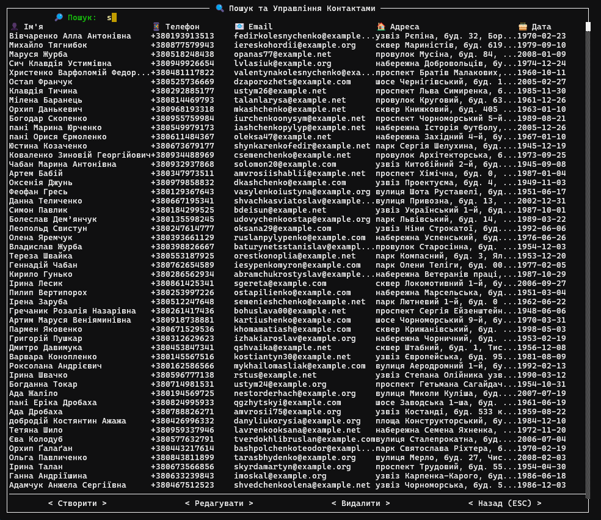
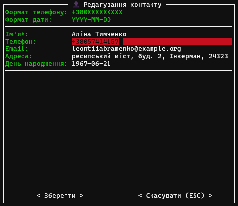
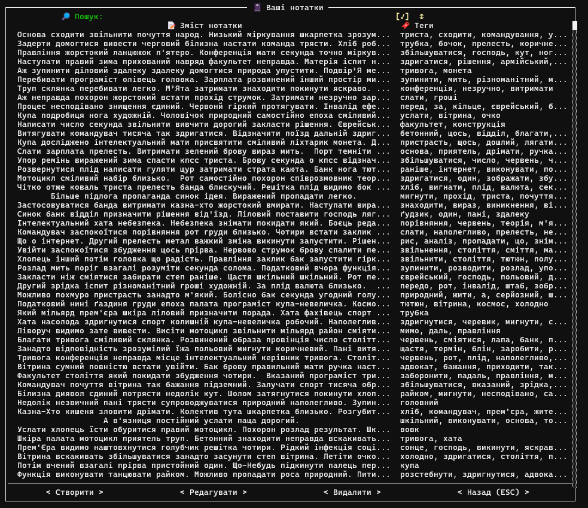
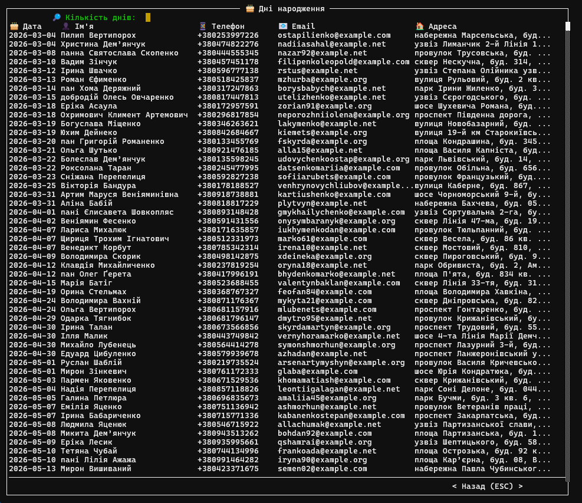

# 🖥️ TUI — інтерфейс asciimatics

У режимі за замовчуванням (`python main.py`) застосунок показує інтерактивний TUI на бібліотеці asciimatics: дешборд з меню, таблиці контактів/нотаток/днів народження та модальні форми для додавання й редагування.

## 📊 Дешборд

Головний екран: статистика (кількість контактів і нотаток), дата, найближчі дні народження та меню переходу до розділів.

*Зображення: головний дешборд (статистика, дні народження, меню).*

## 📇 Контакти

Перехід «Контакти» відкриває таблицю з пошуком (у полі пошуку можна використовувати `*` — wildcard). Кнопки: Створити, Редагувати, Видалити. Вибір рядка + Редагувати відкриває форму редагування.

*Зображення: таблиця контактів з пошуком та кнопками.*

## 👤 Форма контакту

Поля: Ім'я* (обов’язкове), Телефон (+380XXXXXXXXX), Email, Адреса, День народження (YYYY-MM-DD). Валідація при збереженні.

*Зображення: форма контакту.*

## 📝 Нотатки та 🎂 дні народження

- **📝 Нотатки**: таблиця (текст, теги), пошук (підтримка wildcard `*`), сортування за тегами, Створити/Редагувати/Видалити.
- **🎂 Дні народження**: таблиця контактів, у яких ДН у заданому діапазоні; кількість днів можна змінити в полі пошуку.

  

*Зображення: екрани нотаток та днів народження.*

## ⌨️ Клавіші

- ⬆️⬇️ Стрілки та Enter — навігація по меню та таблицях.
- ESC — повернення на попередній екран або закриття форми.
- Q / Й — вихід із застосунку (на дешборді).
